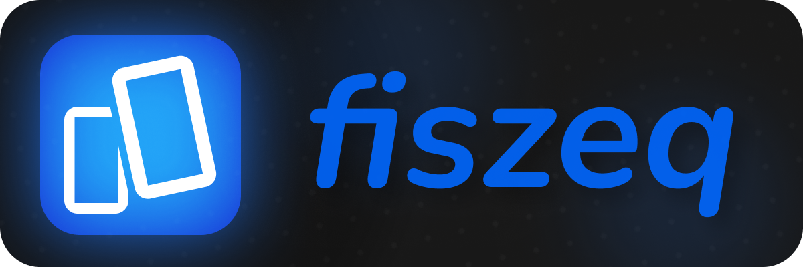

[Wersja Polska 🇵🇱](https://github.com/aasd24/fiszeq/blob/main/README-pl.md)

# Fiszeq

Fiszeq is a web application helping you learn by utilizing flashcards.

This application is currently under heavy development, more information and features will come at a later date.

# Installation

Fiszeq is available [here](https://aasd24.github.io/fiszeq).

# Development

Fiszeq works best on the last version of [Node.js](https://nodejs.org/) (v22.11.0).

Install the dependencies and devDependencies and start the local development server.

```sh
npm install
npm run dev
```
